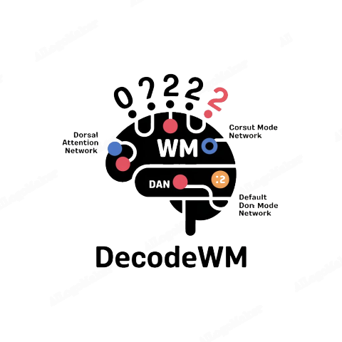
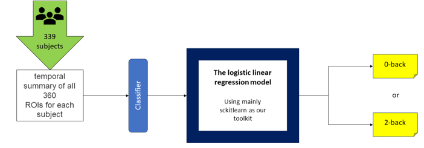
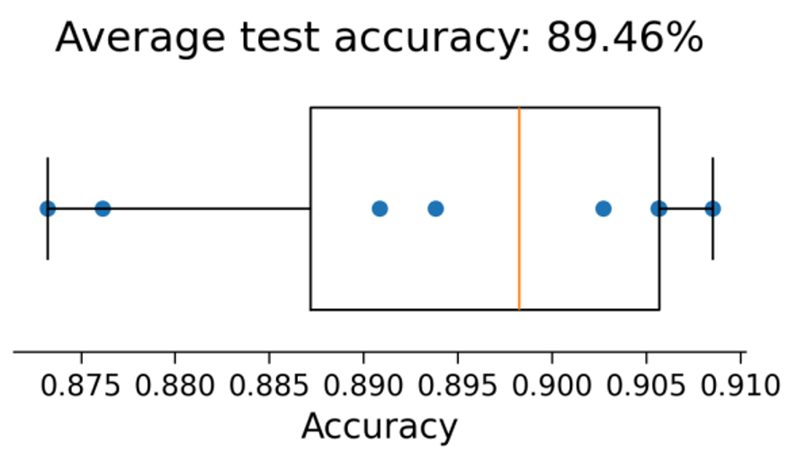
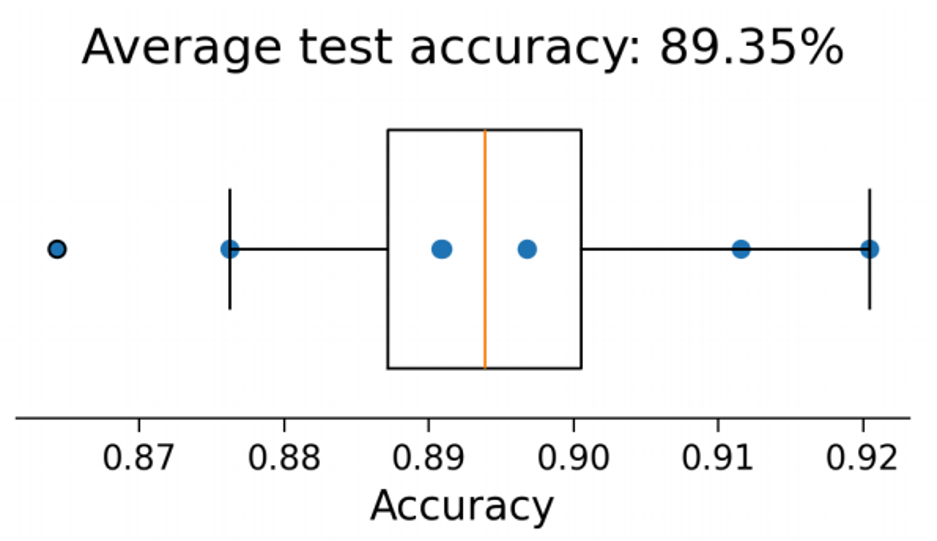

<div align="center">
<a href="https://github.com/mqqq333/DecodeWM" target="blank">

</a>

<h2> DecodeWM: Predictive Model for Memory Load Types in N-back Working Memory Task </h2>






</div>

## 💡 Overview

**DecodeWM** is a predictive model for classifying **working memory (WM) load types** using task-based fMRI data. The project focuses on analyzing **how different memory loads impact brain activity** and leverages machine learning models to classify WM task conditions based on neural responses.
By utilizing **HCP (Human Connectome Project) fMRI data**, the study applies **logistic regression** and **random forest classifiers** to predict memory load conditions (e.g., **0-back vs. 2-back tasks**). The classification results not only validate the effectiveness of **machine learning in cognitive neuroscience** but also provide insights into the functional characteristics of brain regions involved in **WM processing**.
Through **feature importance analysis**, the study identifies key **brain networks**, such as the **Default Mode Network (DMN)**, **Frontoparietal Network (FPN)**, **Cingulo-Opercular Network (CON)**, and **Dorsal Attention Network (DAN)**, which are most relevant to working memory tasks. These findings contribute to future research on **memory load representation and neural mechanisms in cognitive neuroscience**.
## ✨ Features

- **🧠 WM Load Classification**: Uses **task-based fMRI data** to analyze how different memory loads affect brain activity.
- **📊 Machine Learning Models**: Implements **logistic regression** and **random forest** classifiers to predict **0-back vs. 2-back** task conditions.
- **🔥 High Classification Accuracy**: Achieves **88% accuracy** in distinguishing memory load types based on **ROI (Region of Interest) activity levels**.
- **🔍 Feature Importance Analysis**: Identifies key **brain networks** (**DMN, FPN, CON, DAN**) that play crucial roles in working memory processing.
- **🛠️ Neuroscientific Relevance**: Provides insights into **WM-related brain networks**, supporting further cognitive neuroscience research.

Whether you're a cognitive neuroscience enthusiast or a machine learning researcher, **DecodeWM** is the perfect project for exploring the intersection of **working memory analysis and AI-driven neuroimaging classification**. 🌟 You’ll gain hands-on experience with **task-based fMRI data**, learn how **machine learning models** can classify cognitive load, and uncover key insights into **brain network dynamics**—providing a solid foundation for further research in **computational neuroscience and cognitive modeling**.
## 👩‍💻 Tech Stack

- **Python** 🐍 – Core programming language for data processing and model implementation.
- **scikit-learn** 📊 – Used for **logistic regression** and **random forest** classification.
- **Nilearn** 🧠 – Library for neuroimaging analysis and visualization of fMRI data.
## 📖 Sources and external API's
- **HCP (Human Connectome Project) API** 🌍 – Provides access to **task-based fMRI datasets**, enabling large-scale analysis of **working memory-related brain activity**.
- **Nilearn** 🧩 – A neuroimaging library for decoding fMRI signals, performing **statistical analyses**, and visualizing **brain activation maps**.
## 📦 Getting Started

To get a local copy of **DecodeWM** up and running, follow these steps.

### 🚀 Prerequisites

- **Python** (v3.8 or higher) and **pip** (or **conda** for package management).
## 🛠️ Installation

1. **Clone the repository:**
   ```bash
	git clone https://github.com/mqqq333/DecodeWM.git
	cd DecodeWM
   ```
2. Open `./src/n_back_fmri.ipynb`in your jupyter notebook

## 🤝 Contributing

We welcome contributions to **DecodeWM**! If you'd like to contribute, please follow the steps below:
1. **Fork the repository.**
2. **Create a new branch** (`git checkout -b feature/your-feature-name`).
3. **Make your changes** and commit them (`git commit -m 'Add some feature'`).
4. **Push to the branch** (`git push origin feature/your-feature-name`).
5. **Open a pull request**.

Please make sure to update tests as appropriate.

## 🐛 Issues

If you encounter any issues while using or setting up the project, please check the [Issues]() section to see if it has already been reported. If not, feel free to open a new issue detailing the problem.

When reporting an issue, please include:

- A clear and descriptive title.
- A detailed description of the problem.
- Steps to reproduce the issue.
- Any relevant logs or screenshots.
- The environment in which the issue occurs (OS, browser, Python version, etc.).

## 📜 License

Distributed under the MIT License. See [License](/LICENSE) for more information.

